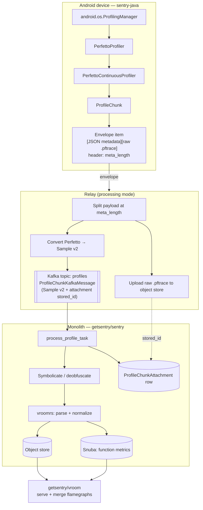

# Perfetto profiling on Android

This document describes how continuous profiling works on Android when the SDK
captures traces through the OS-level [`android.os.ProfilingManager`](https://developer.android.com/reference/android/os/ProfilingManager)
API (available on API 35+), and how a captured **profile chunk** flows all the way
from the device to a downloadable profile in Sentry.

## What Perfetto is

[Perfetto](https://perfetto.dev/) is Google's tracing framework for Android and Linux, and
the tooling Android itself is instrumented with. Its
[callstack sampler](https://perfetto.dev/docs/getting-started/cpu-profiling) interrupts the
app at a fixed frequency, records the native and Java call stacks of the running threads,
and writes them to a binary `.pftrace` file (a serialized
[Perfetto protobuf](https://perfetto.dev/docs/reference/trace-packet-proto)).
Starting with Android 15, apps can request such traces at
runtime via `ProfilingManager` without root or `adb`, which is what makes on-device
continuous profiling possible.

Useful Perfetto references:

- Perfetto docs: https://perfetto.dev/docs/
- CPU profiling with Perfetto: https://perfetto.dev/docs/getting-started/cpu-profiling
- Trace format (`TracePacket` proto): https://perfetto.dev/docs/reference/trace-packet-proto
- Perfetto UI (to open a downloaded `.pftrace`): https://ui.perfetto.dev/

## Pipeline overview

Profile chunks travel the standard ingestion path described in
[general-pipeline.md](general-pipeline.md) — SDK envelope,
[Relay](https://develop.sentry.dev/ingestion/relay/) (Sentry's ingestion proxy), Kafka, a
monolith processing task, then storage and a read API. Read that first; the rest of this
document covers only where Perfetto deviates from it.

The deviations are:

- The envelope item carries **JSON and raw binary in one payload**, subdivided by a
  `meta_length` header rather than base64-encoding the trace ([details](#envelope-format-and-the-meta_length-header)).
- Relay **converts** the Perfetto trace into the existing Sample v2 profile format, and
  additionally **keeps the raw `.pftrace`** in the object store so it can be downloaded
  later ([details](#relay-getsentryrelay)).



## SDK (getsentry/sentry-java)

On API 35+, [`AndroidOptionsInitializer`](../sentry-android-core/src/main/java/io/sentry/android/core/AndroidOptionsInitializer.java)
wires up `PerfettoContinuousProfiler` automatically. On older devices the SDK falls back
to the legacy `Debug`-based [`AndroidContinuousProfiler`](../sentry-android-core/src/main/java/io/sentry/android/core/AndroidContinuousProfiler.java),
gated by the `enableLegacyProfiling` option (manifest key
`io.sentry.profiling.enable-legacy-profiling`, defaults to `true`). Only **continuous
profiling** is supported on the Perfetto path — transaction-based and app-start profiling
are not.

### Capturing chunks

Continuous profiling emits a stream of independent [`ProfileChunk`](../sentry/src/main/java/io/sentry/ProfileChunk.java)s
rather than one profile per transaction. `PerfettoContinuousProfiler` drives a chained
loop: each chunk runs for `MAX_CHUNK_DURATION_MILLIS` (60s) via `PerfettoProfiler`, which
calls `ProfilingManager.requestProfiling(PROFILING_TYPE_STACK_SAMPLING, …)` at
`PROFILING_FREQUENCY_HZ` (101 Hz). When a chunk's trace file is ready, a new chunk starts,
so profiling runs continuously.

A chunk keeps a stable `profilerId` across the session and a per-chunk `chunkId`. When the
OS produces the trace file, the profiler builds a `ProfileChunk` tagged with the Perfetto
content type:

```kotlin
ProfileChunk.Builder(profilerId, chunkId, measurements, traceFile, timestamp, ProfileChunk.PLATFORM_ANDROID)
    .setContentType(ProfileChunk.CONTENT_TYPE_PERFETTO) // "application/x-perfetto-trace"
    .build()
```

The chunk is captured via `scopes.captureProfileChunk(...)` and sent as its own envelope
with item type [`SentryItemType.ProfileChunk`](../sentry/src/main/java/io/sentry/SentryItemType.java)
(wire name `profile_chunk`).

### Envelope format and the `meta_length` header

A legacy chunk base64-encodes its trace into the `ProfileChunk` JSON. A Perfetto chunk is
much larger, so [`SentryClient`](../sentry/src/main/java/io/sentry/SentryClient.java) instead
routes it through the new `SentryEnvelopeItem.fromPerfettoProfileChunk(...)` factory, which
avoids base64 by sending the raw binary alongside the JSON.

The trick is a single envelope **item** whose payload concatenates the JSON metadata and
the raw `.pftrace` bytes with **no delimiter**:

```text
[ProfileChunk JSON bytes][raw .pftrace binary bytes]
```

A new `meta_length` property on the [envelope item header](../sentry/src/main/java/io/sentry/SentryEnvelopeItemHeader.java)
tells the server where the JSON ends and the binary begins. The standard envelope item
structure (header line + newline + payload) is unchanged; `meta_length` simply subdivides
the payload:

```text
{"type":"profile_chunk","content_type":"application/x-perfetto-trace","filename":"…","length":<total>,"meta_length":<json bytes>}
<ProfileChunk JSON><raw perfetto binary>
```

- `length` — total payload size (JSON + binary), as for any envelope item.
- `meta_length` — byte length of the JSON prefix. It is only known after the payload is
  serialized, so the header computes it lazily (via a `Callable<Integer>`) and omits the
  field entirely for non-Perfetto items, keeping the change backward compatible.

## Relay (getsentry/relay)

In processing mode Relay:

1. **Splits** the compound item payload at `meta_length` into `(metadata JSON, raw profile)`
   and reads `content_type: "perfetto"` from the metadata.
2. **Converts** the binary Perfetto trace into the existing **Sample v2** profile JSON
   format (`relay_profiling::expand_perfetto(...)`, backed by a checked-in subset of the
   Perfetto protobuf definitions).
3. **Uploads** the raw `.pftrace` blob to object store (usecase `profiles`, keyed per
   org/project, with an attachment-retention TTL).
4. **Produces** a `ProfileChunkKafkaMessage` to the `profiles` Kafka topic. The message
   carries the expanded Sample v2 JSON as `payload` plus an `attachments` array, where each
   attachment records:
   - `name` (e.g. `profile.perfetto`),
   - `content_type` (e.g. `application/x-perfetto-trace`),
   - `stored_id` — the object store key of the uploaded raw blob.

```json
{
  "organization_id": 1,
  "project_id": 42,
  "received": 1720000000,
  "retention_days": 30,
  "payload": "<expanded Sample v2 profile JSON>",
  "attachments": [
    {
      "name": "profile.perfetto",
      "content_type": "application/x-perfetto-trace",
      "stored_id": "<object store key of the raw .pftrace blob>"
    }
  ]
}
```

The monolith later uses `stored_id` to fetch the raw trace back.

## Monolith (getsentry/sentry)

`process_profile_task` (in `src/sentry/profiles/task.py`) consumes the `profiles` topic.
Because Relay already converted the trace to Sample v2, the task treats a Perfetto chunk
like any other: deobfuscate, hand it to `vroomrs` to parse and normalize
(`vroomrs.profile_chunk_from_json_str(...)`), compress and store it, and emit function
metrics to Snuba.

The Perfetto-specific step is the last one: for each attachment on the message the task
persists a lightweight **`ProfileChunkAttachment`** row — `project_id`, `profiler_id`,
`chunk_id`, `name`, `content_type`, and the `stored_id` object store key. The row exists so
the raw trace can be downloaded by ID without exposing the `stored_id`.

Flamegraphs themselves are served by `getsentry/vroom`, which reads the stored chunks and
the Snuba-indexed metadata and merges several chunks into one flamegraph. The endpoint
lives in the monolith and passes the request through.

### Perfetto format dispatch (vroom / vroomrs)

Older Android SDKs emit the legacy Android trace format tagged as a "faulty" `version=2`,
and the pipeline historically keyed off the platform rather than the version. To
distinguish legacy from Sample v2 chunks, `ProfileChunk` carries a dedicated `version`
field, and both `vroom` and `vroomrs` now dispatch on it instead of the platform:

- Version `""` or `2.android-trace` → legacy Android trace format.
- Any other version → Sample v2.

## Downloading a Perfetto profile

The monolith exposes two feature-gated endpoints:

- **List attachments** — `GET /organizations/{org}/profiling/chunk-attachments/`
  (`sentry-api-0-organization-profiling-chunk-attachments`). Requires a `project` and
  `profiler_id`; resolves the visible `chunk_id`s (same logic as the flamegraph) and returns
  the matching `ProfileChunkAttachment` metadata.
- **Download** — `GET /projects/{org}/{project}/profiling/chunks/{profiler_id}/{chunk_id}/attachments/{attachment_id}/?download`
  (`sentry-api-0-project-profiling-chunk-attachment`). The `?download` param is required; it
  streams the raw blob back from object store via the stored `stored_id`. Access requires
  the org's configured attachments role, analogous to generic event attachments.

In the flamegraph UI, a toolbar button (added for continuous profiles when the flag is on
and at least one attachment exists) lists and provides a way to download these traces.

## References

- SDK: [sentry-java#5251](https://github.com/getsentry/sentry-java/pull/5251) — Android `ProfilingManager` (Perfetto) support
- Relay: [#5659](https://github.com/getsentry/relay/pull/5659), [#5932](https://github.com/getsentry/relay/pull/5932), [#6099](https://github.com/getsentry/relay/pull/6099), [#6102](https://github.com/getsentry/relay/pull/6102) — Perfetto parsing, pipeline, and object-store routing
- vroom: [#672](https://github.com/getsentry/vroom/pull/672) — version dispatch for Android trace profiles
- vroomrs: [#93](https://github.com/getsentry/vroomrs/pull/93) — accept Android profiles in Sample v2 format
- Monolith: [sentry#118029](https://github.com/getsentry/sentry/pull/118029) (chunk attachments + endpoints), [sentry#118071](https://github.com/getsentry/sentry/pull/118071) (flamegraph download button)
