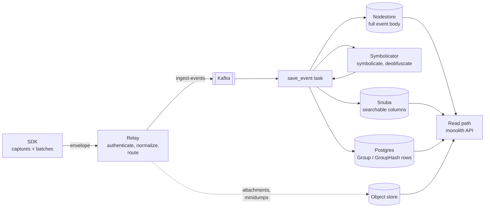
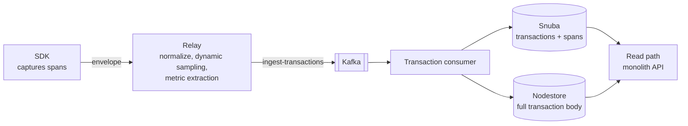
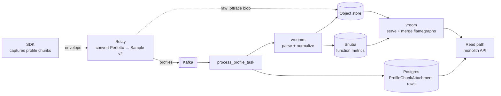

# Ingestion pipeline

This document describes the path data takes from an SDK to a rendered view in Sentry. It
covers the parts of different payload types, like errors, transactions, logs, replays and
profile chunks.

## Per data category

Every payload takes the same four hops — SDK, Relay, a consumer in the monolith, and a read
API — but the topics, processing tasks, and stores differ per category. The diagrams below
show three of them; the hops themselves are described further down.

### Errors

### Transactions

### Profile chunks

## The hops

### 1. SDK

The SDK captures data and wraps it in an [envelope](https://develop.sentry.dev/sdk/data-model/envelopes/):
a JSON header followed by one or more items, each with its own header declaring a `type`,
a `length`, and optionally a `content_type`. The envelope is POSTed to the project's
`/api/{project_id}/envelope/` endpoint.

The item `type` is what routes the payload through everything downstream, so adding a new
kind of data means adding an item type, not a new endpoint. Item payloads are usually JSON;
binary payloads are allowed and are preferable to base64-encoding a large blob into JSON.

### 2. Relay

[Relay](https://github.com/getsentry/relay) is Sentry's ingestion proxy — it sits between
the SDK and the rest of the infrastructure and is the first service to inspect a payload.
See the [Relay chapter in develop docs](https://develop.sentry.dev/ingestion/relay/) for
the full picture.

Relay authenticates the DSN, applies quotas and rate limits, filters and normalizes the
payload, and forwards it. Two behaviours matter when designing a new payload type:

- Relay may **convert** a payload into a different format before publishing it, so the
  format the SDK sends and the format the backend consumes are not necessarily the same.
  Whatever Relay publishes is the contract every downstream service depends on.
- Relay runs in two modes. Only **processing mode** (the one Sentry operates) talks to
  Kafka and the object store; a self-hosted Relay in proxy mode just forwards envelopes
  upstream.

Relay publishes to a **Kafka topic per data category**. Payloads too large to sit
comfortably in a Kafka message are uploaded to the **object store** instead, and the
message carries a reference to the stored blob rather than the bytes themselves. Event
attachments (minidumps, screenshots, view hierarchies) work this way, and so does the raw
`.pftrace` blob of a Perfetto profile chunk: Relay uploads the trace and puts only its
`stored_id` object store key on the Kafka message.

### 3. Consumers and processing

Each topic is consumed by the monolith ([getsentry/sentry](https://github.com/getsentry/sentry)),
which runs a processing task per message. This is where the work that needs Sentry-side
state happens — symbolication and deobfuscation against uploaded debug files, enrichment,
normalization, and quota accounting.

A task typically writes to more than one store:

- **Object store** — the payload itself, compressed. Cheap to keep, not queryable.
- **Snuba** — the columns that need to be searched, aggregated, or listed.
- **Postgres** — small metadata rows that the API needs to resolve a request, for example
  a row per stored blob so it can be fetched by ID instead of by exposing its storage key.

### 4. Read path

The monolith serves the API endpoints. For some categories it does the work itself; for
others it authorizes the request and proxies it to a dedicated service that owns the
heavy read logic. Either way the endpoint is the public surface, and the storage keys and
internal services stay behind it.

See [feature/profiling/perfetto.md](../feature/profiling/perfetto.md) for a worked example.
