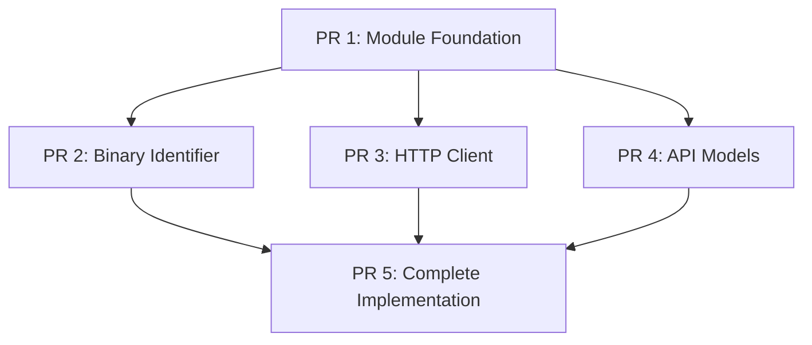

# Sentry Android Distribution - PR Submission Plan

This document outlines the 5-PR submission strategy for the `sentry-android-distribution` module, breaking down the implementation into individually reviewable, compilable components.

## Strategy Overview

Each PR is designed to:
- ✅ Compile independently 
- ✅ Be focused on a single concern
- ✅ Enable parallel review (where dependencies allow)
- ✅ Provide clear rollback points if issues arise

## PR Breakdown

### ✅ PR 1: Module Foundation with Stubs - [#4712](https://github.com/getsentry/sentry-java/pull/4712)
**Status**: Created and ready for review  
**Dependencies**: None  
**Branch**: `no/distribution-module-foundation`

**Contains**:
- Android module configuration (`build.gradle.kts`)
- AndroidManifest.xml with ContentProvider for auto-initialization
- Complete public API structure with compilation stubs:
  - `Distribution.kt` - Main public API object
  - `DistributionOptions.kt` - Configuration class
  - `UpdateStatus.kt` - Sealed class for result types
  - `UpdateInfo.kt` - Data class for update details
  - `DistributionContentProvider.kt` - Auto-initialization provider
  - `internal/DistributionInternal.kt` - Internal stub implementations

**Key Feature**: All methods return placeholder errors ("Implementation coming in future PR") but compile successfully.

---

### ✅ PR 2: Binary Identifier Implementation - [#4713](https://github.com/getsentry/sentry-java/pull/4713)
**Status**: Created and ready for review  
**Dependencies**: Requires PR 1 merged  
**Branch**: `no/distribution-binary-identifier`

**Contains**:
- `internal/BinaryIdentifier.kt` - Complete APK parsing implementation
- Updated `DistributionInternal.kt` - Uses real binary identifier extraction

**Features**:
- Extracts SHA-256/SHA-512 digests from APK signing blocks (V2/V3)
- Follows Android APK signing format specification
- Zero external dependencies (uses Android's built-in Base64)
- Gracefully handles parsing failures
- Similar approach to Emerge Tools' implementation

---

### 📋 PR 3: HTTP Client Implementation
**Status**: Planned  
**Dependencies**: Requires PR 1 merged  
**Branch**: `no/distribution-http-client`

**Will Contain**:
- `internal/SentryHttpClient.kt` - Complete HTTP client implementation
- Updated `DistributionInternal.kt` - Integrates HTTP client functionality

**Planned Features**:
- Reuses Sentry's networking infrastructure (proxy, SSL, timeouts)
- Bearer token authentication for org auth tokens
- Proper error handling and response parsing
- Integration with existing Sentry RequestDetails patterns

---

### 📋 PR 4: API Models Implementation  
**Status**: Planned  
**Dependencies**: Requires PR 1 merged  
**Branch**: `no/distribution-api-models`

**Will Contain**:
- `internal/ApiModels.kt` - Complete JSON parsing implementation
- Updated `DistributionInternal.kt` - Uses real API models for parsing

**Planned Features**:
- JSON parsing using Android's built-in `org.json` (zero external dependencies)
- Models for Sentry preprod artifacts API response format
- Conversion utilities between internal and public API models
- Robust error handling for malformed responses

---

### 📋 PR 5: Complete Implementation
**Status**: Planned  
**Dependencies**: Requires PRs 1-4 merged  
**Branch**: `no/distribution-core-implementation`

**Will Contain**:
- Complete `DistributionInternal.kt` - Full business logic implementation
- Updated `Distribution.kt` - Remove placeholder error returns
- Updated `DistributionContentProvider.kt` - Add real auto-initialization
- Enhanced logging for debugging API integration issues

**Planned Features**:
- Complete async/sync update checking with CompletableFuture
- Background thread execution with proper error handling
- API URL construction for Sentry preprod artifacts endpoint
- Integration of all previous components (binary ID + HTTP + API models)
- Comprehensive error states and logging for production debugging

## Benefits of This Approach

### 🔄 Parallel Development
- PRs 2, 3, and 4 can be developed simultaneously after PR 1 merges
- Review bandwidth can be distributed across multiple focused PRs
- Components can be tested independently before integration

### 🎯 Focused Reviews  
- Each PR has a single, clear responsibility
- Reviewers can provide targeted feedback on specific aspects
- Reduced cognitive load per review session
- API design feedback can be gathered early (PR 1)

### 🛡️ Risk Management
- Individual components can be rolled back without affecting others  
- Clear fallback points if issues arise during integration
- Incremental testing and validation at each stage
- Easy to identify root cause of issues in specific components

### ⚡ Faster Integration
- No large, monolithic PR that blocks other work
- Smaller PRs typically get reviewed and merged faster
- Continuous integration of stable components
- Early validation of architectural decisions

## Dependencies & Review Order

**Optimal Review Timeline**:
1. **Week 1**: Review and merge PR 1 (Foundation)
2. **Week 2**: Review PRs 2, 3, 4 in parallel
3. **Week 3**: Review and merge PR 5 (Integration)

## Current Status

- **✅ PR 1**: Created [#4712](https://github.com/getsentry/sentry-java/pull/4712) - Ready for review
- **✅ PR 2**: Created [#4713](https://github.com/getsentry/sentry-java/pull/4713) - Ready for review  
- **⏳ PR 3**: Ready to create once PR 1 merges
- **⏳ PR 4**: Ready to create once PR 1 merges
- **⏳ PR 5**: Waiting for PRs 1-4 to merge

## Technical Notes

### Zero External Dependencies
All PRs maintain the core constraint of zero external dependencies beyond the `sentry` module:
- No coroutines (uses CompletableFuture + Executor)
- No external JSON libraries (uses Android's org.json)
- No HTTP libraries (reuses Sentry's networking stack)

### Compilation Independence
Each PR compiles successfully on its own:
- PR 1 uses stub implementations that return placeholder errors
- PRs 2-4 incrementally replace stubs with real implementations
- PR 5 completes the integration and removes final stubs

### API Consistency
The public API remains consistent across all PRs, only internal implementation changes between them.

---

*Generated with [Claude Code](https://claude.ai/code)*